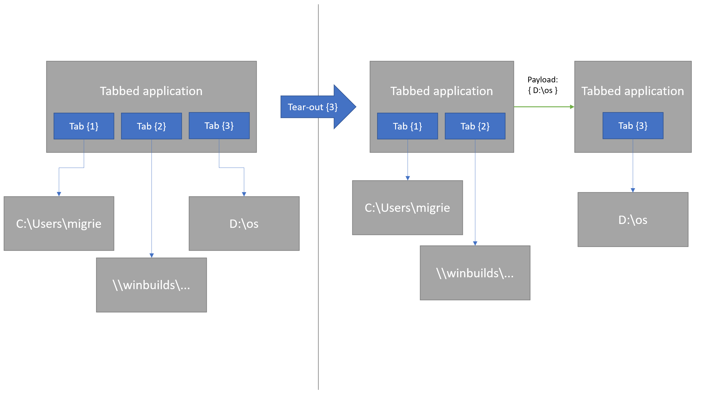
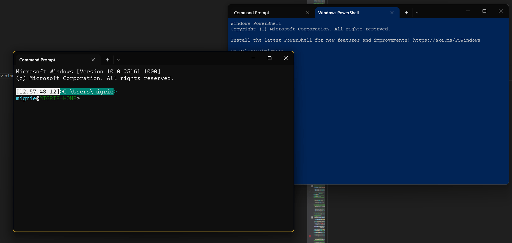

# Terminal Process Model 2.0

### Mike Griese

_November 29, 2022_

---

<style>
div.twocols {
  /* margin-top: 35px; */
  /* margin-bottom: 35px; */
  column-count: 2;
}
div.twocols p:first-child,
div.twocols img: { height: 70%} ,
div.twocols h1:first-child,
div.twocols h2:first-child,
div.twocols ul:first-child,
div.twocols ul li:first-child,
div.twocols ul li p:first-child {
  margin-top: 0 !important;
}
div.twocols p.break {
  break-before: column;
  margin-top: 0;
}
</style>


<div class="twocols">


<p class="break"></p>


# Current Process Model

* All one process
* `Connection` talks to ConPTY (conhost), which is responsible for communicating with client apps (`cmd`, `pwsh`, `WSL`, `ssh`)
* `TermControl` is the XAML control responsible for drawing the buffer to the screen, via DX
* `App` hosts the UI of the app, including other XAML elements

</div>

---

<div class="twocols">


<p class="break"></p>

# Current Process Model

* All one process
* `App` hosts the UI of the app, including other XAML elements
* Multiple tabs each host their own `TermControl`s, who talk to their own `Connection`s

</div>

---

# PROBLEM – Tab tear-out & merge



---


# PROBLEM – Tab tear-out & merge

<div class="twocols">

### BUFFER CONTENTS
   How do we move 9001x32 (or more) characters, attributes, and other properties from one process to another quickly & efficiently?
### PERFORMANCE
   Any solution cannot meaningfully impact overall Terminal throughput and input responsiveness

<p class="break"></p>

### WINDOW RELIABILITY
   We’d rather that crashes in one window don’t end up bringing down all your Terminal windows, so we should have one top-level window per-process
### XAML ISLANDS
   The Terminal is a XAML Islands application (with no path to WinUI 3 at the moment). There’s no way to have multiple XI windows in the same process currently.

</div>

---

# SOLUTION

## WINDOW AND CONTENT PROCESSES

Separate the Terminal into two types of process – Window, and Content.

### Window
The process with the actual Terminal HWND and XAML UI tree.

### Content
Hosts the terminal buffer and connection to client application.

---

<div class="twocols">


<p class="break"></p>

# Proposed Process Model

* Each connection / client / terminal instance lives in its own “Content Process”
* All XAML lives in a “Window Process”
* Windows host the content of multiple Content Processes

</div>

---

<div class="twocols">


<p class="break"></p>

# Proposed Process Model

* Each connection / client / terminal instance lives in its own “Content Process”
* All XAML lives in a “Window Process”
* Windows host the content of multiple Content Processes

</div>

---

<div class="twocols">


<p class="break"></p>

# Proposed Process Model

* Each connection / client / terminal instance lives in its own “Content Process”
* All XAML lives in a “Window Process”
* Windows host the content of multiple Content Processes

</div>

---

# Proposed Process Model

COM & WinRT is magic.
<br>
<br>
<br>
<br>

---

# Proposed Process Model

* We’d rather not roll our own IPC mechanism to communicate between Window and Content processes
* WinRT (COM) already gives us a rich set of features for defining methods, events
* WinRT can already be used x-proc
* Small<sup>[1]</sup> refactors to the `TermControl` code enabled us to create a WinRT boundary between the XAML code and the “core”

<sub> [1] _for some definition of small meaning quite large_</subs>

---

<!-- # Proposed Process Model -->

<!--  -->

<div class="twocols">


<p class="break"></p>

# Proposed Process Model

* Each “Content Process” has it's own GUID
* Any window can connect to a content process just by it's GUID
* To move content from one pane to another, all you need to serialize is the GUID

</div>

---

# Proposed Process Model

The content process registers itself with `CoRegisterClassObject`, like so:
  ```c++
  CoRegisterClassObject(MyContentGUID,
                        winrt::make<ContentProcess>().get(),
                        CLSCTX_LOCAL_SERVER,
                        REGCLS_MULTIPLEUSE,
                        &dwRegistration);

  ```

The Window can get this _specific_ instance of `ContentProcess` with
  ```c++
  auto content = create_instance<winrt::ContentProcess>(MyContentGUID, CLSCTX_LOCAL_SERVER);
  ```

---

# Drop tab on an existing window


---

# PROOF OF CONCEPT



---

# Questions

Mike Griese (migrie)
[@zadjii-msft](https://github.com/zadjii-msft)
[Terminal Repo](https://github.com/microsoft/terminal)
[Original doc link](https://github.com/microsoft/terminal/blob/main/doc/specs/%235000%20-%20Process%20Model%202.0/%235000%20-%20Process%20Model%202.0.md)
[Tracking issue](https://github.com/microsoft/terminal/issues/5000)

---

# Addenda

---
<!--

# Window-Content IPC

* We’d rather not roll our own IPC mechanism to communicate between Window and Content processes
* WinRT (COM) already gives us a rich set of features for defining methods, events
* WinRT can already be used x-proc
* Small<sup>[1]</sup> refactors to the `TermControl` code enabled us to create a WinRT boundary between the XAML code and the “core”


<sub> [1] _for some definition of small meaning quite large_</subs>

---

# Serialization of a Tab?

* TODO!
* we used the existing serialization code, it was grand!

--- -->

# Terminal / Console Architecture


---

# Mixed Elevation


