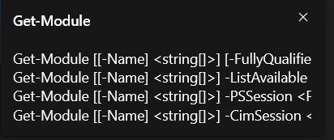

# Shell Completions Protocol

## Abstract

> Note:
>
> This is a draft document - mainly just notes from early iterations on the
> [Suggestions UI]. The protocol laid out in this version of the doc is very
> much not finalized.
>
> It is included with the remainder of my North Star docs, because it was always
> a part of that story. As we iterate on this protocol, we'll revise this doc
> with the final protocol.

## Background
### Inspiration
### User Stories
### Elevator Pitch
### Business Justification

## Solution Design

### Escape sequence 
```
OSC 633 ; Completions ; Ri ; Rl ; Ci ; Js ST
```
where
* `Ri`: the replacement index (TODO!?)
* `Rl`: the replacement length (TODO!?)
* `Rl`: the current cursor position in the command (TODO!?)
* `Js`: A json-encoded blob describing the suggested completions. See [Completion Schema](#completion-schema) for a more thorough description


### Completion Schema


#### Example JSON blobs

* Typed text: ```Get-M```

```jsonc
[
    {
        "CompletionText": "Get-MarkdownOption",
        "ListItemText": "Get-MarkdownOption",
        "ResultType": 2,
        "ToolTip": "Get-MarkdownOption\r\n"
    },
    {
        "CompletionText": "Get-Member",
        "ListItemText": "Get-Member",
        "ResultType": 2,
        "ToolTip": "Get-Member\r\n"
    },
    {
        "CompletionText": "Get-Module",
        "ListItemText": "Get-Module",
        "ResultType": 2,
        "ToolTip": "\r\nGet-Module [[-Name] <string[]>] [-FullyQualifiedName <ModuleSpecification[]>] [-All] [<CommonParameters>]\r\n\r\nGet-Module [[-Name] ... (omitted for brevity)"
    },
    // ...
]

```

* Typed text: ```Get-Module ```

```json
[
    {
        "CompletionText": "Microsoft.PowerShell.Management",
        "ListItemText": "Microsoft.PowerShell.Management",
        "ResultType": 8,
        "ToolTip": "Description: \r\nModuleType: Manifest\r\nPath: C:\\program files\\powershell\\7\\Modules\\Microsoft.PowerShell.Management\\Microsoft.PowerShell.Management.psd1"
    },
    {
        "CompletionText": "Microsoft.PowerShell.Utility",
        "ListItemText": "Microsoft.PowerShell.Utility",
        "ResultType": 8,
        "ToolTip": "Description: \r\nModuleType: Manifest\r\nPath: C:\\program files\\powershell\\7\\Modules\\Microsoft.PowerShell.Utility\\Microsoft.PowerShell.Utility.psd1"
    },
    {
        "CompletionText": "PSReadLine",
        "ListItemText": "PSReadLine",
        "ResultType": 8,
        "ToolTip": "Description: Great command line editing in the PowerShell console host\r\nModuleType: Script\r\nPath: C:\\program files\\powershell\\7\\Modules\\PSReadLine\\PSReadLine.psm1"
    }
]
```


### PowerShell function

```ps1
function Send-Completions {
    $commandLine = ""
    $cursorIndex = 0
    
    [Microsoft.PowerShell.PSConsoleReadLine]::GetBufferState([ref]$commandLine, [ref]$cursorIndex)
    $completionPrefix = $commandLine

    # Get completions
    $result = "`e]633;Completions"
    if ($completionPrefix.Length -gt 0) {
        # Get and send completions
        $completions = TabExpansion2 -inputScript $completionPrefix -cursorColumn $cursorIndex
        if ($null -ne $completions.CompletionMatches) {
            $result += ";$($completions.ReplacementIndex);$($completions.ReplacementLength);$($cursorIndex);"
            $result += $completions.CompletionMatches | ConvertTo-Json -Compress
        }
    }
    $result += "`a"

    Write-Host -NoNewLine $result
}
```

## UX / UI Design


### Description tooltips

### Segoe Fluent Icons

See: https://github.com/PowerShell/PowerShellEditorServices/pull/1738

| Name                | val | Icon ideas            | description
| ------------------- | --- | --------------------- | --------------
| Text                | 0   |                       | An unknown result type, kept as text only.
| History             | 1   |e81c    History        | A history result type like the items out of get-history.
| Command             | 2   |ecaa   AppIconDefault  | A command result type like the items out of get-command.
| ProviderItem        | 3   |e8e4   AlignLeft       | A provider item.
| ProviderContainer   | 4   |e838    FolderOpen     | A provider container.
| Property            | 5   |e7c1 Flag              | A property result type like the property items out of get-member.
| Method              | 6   |ecaa   AppIconDefault  | A method result type like the method items out of get-member.
| ParameterName       | 7   |e7c1 Flag              | A parameter name result type like the Parameters property out of get-command items.
| ParameterValue      | 8   |f000   KnowledgeArticle| A parameter value result type.
| Variable            | 9   |                       | A variable result type like the items out of get-childitem variable.
| Namespace           | 10  |e943   Code            | A namespace.
| Type                | 11  |                       | A type name.
| Keyword             | 12  |                       | A keyword.
| DynamicKeyword      | 13  |e945   LightningBolt   | A dynamic keyword.

#### Sample XAML 

The following XAML produces a menu that looks like the following:



I included a scrollviewer, because I couldn't seem to find a way to get the tooltip to be wider. I'm sure there's better ways of styling it in real code (vs just in XAML studio).

```xml
<muxc:TeachingTip x:Name="MyTooltip"
                  IsOpen="True"
                  MinWidth="900"
                  Title="Get-Module">
    <ScrollViewer HorizontalScrollMode="Enabled" HorizontalScrollBarVisibility="Hidden" >
        <TextBlock>
            <Run>Get-Module [[-Name] &lt;string[]&gt;] [-FullyQualifiedName &lt;ModuleSpecification[]&gt;] [-All] [&lt;CommonParameters&gt;]
            </Run>
            <LineBreak/>
            <Run>Get-Module [[-Name] &lt;string[]&gt;] -ListAvailable [-FullyQualifiedName &lt;ModuleSpecification[]&gt;] [-All] [-PSEdition &lt;string&gt;] [-SkipEditionCheck] [-Refresh] [&lt;CommonParameters&gt;]
            </Run>
            <LineBreak/>
            <Run>Get-Module [[-Name] &lt;string[]&gt;] -PSSession &lt;PSSession&gt; [-FullyQualifiedName &lt;ModuleSpecification[]&gt;] [-ListAvailable] [-PSEdition &lt;string&gt;] [-SkipEditionCheck] [-Refresh] [&lt;CommonParameters&gt;]
            </Run>
            <LineBreak/>
            <Run>Get-Module [[-Name] &lt;string[]&gt;] -CimSession &lt;CimSession&gt; [-FullyQualifiedName &lt;ModuleSpecification[]&gt;] [-ListAvailable] [-SkipEditionCheck] [-Refresh] [-CimResourceUri &lt;uri&gt;] [-CimNamespace &lt;string&gt;] [&lt;CommonParameters&gt;]
            </Run>
        </TextBlock>
    </ScrollViewer>
</muxc:TeachingTip>
```


## Tenents

<table>

<tr><td><strong>Compatibility</strong></td><td>

[TODO!]: TODO! -----------------------------------------------------------------

</td></tr>

<tr><td><strong>Accessibility</strong></td><td>

The SXN UI was designed with the goal of making commandline shell suggestions _more_ accessible. As Carlos previously wrote:

> Screen readers struggle with this because the entire menu is redrawn every time, making it harder to understand what exactly is "selected" (as the concept of selection in this instance is a shell-side concept represented by visual manipulation).
> 
> ...
> 
> _\[Shell driven suggestions\]_ can then be leveraged by Windows Terminal to create UI elements. Doing so leverages WinUI's accessible design. 

This will allow the Terminal to provide more context-relevant information to
screen readers. 

</td></tr>

<tr><td><strong>Sustainability</strong></td><td>

No sustainability changes expected.

</td></tr>

<tr><td><strong>Localization</strong></td><td>

[TODO!]: TODO! -----------------------------------------------------------------
The localization needs of the Suggestions UI will be effectively the same as the
needs of the Command Palette.

</td></tr>

</table>

[Suggestions UI]: ./Suggestions-UI.md
